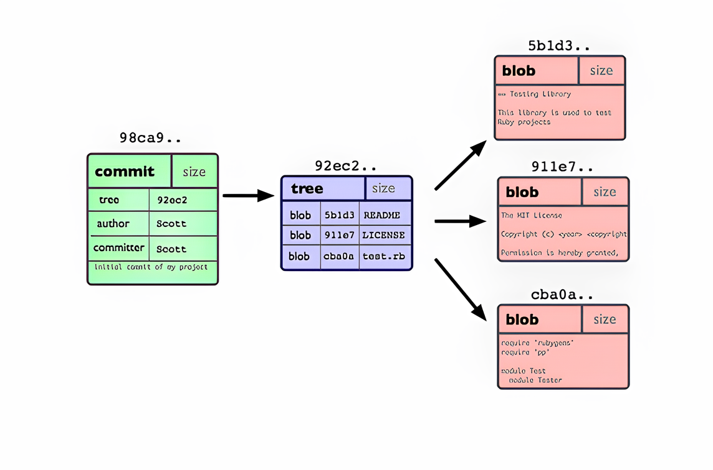
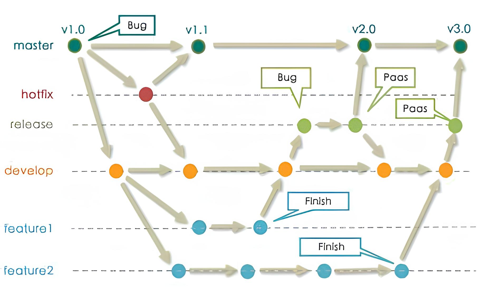
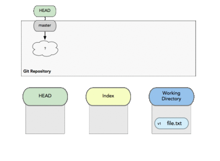
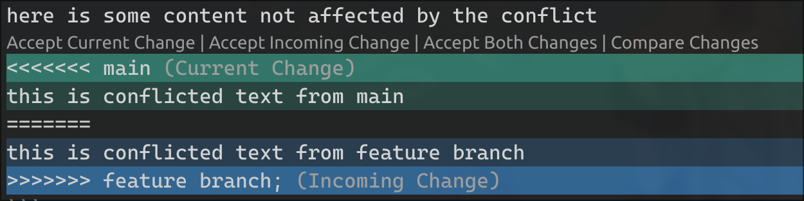

+++  
Git简明教程  
SAST 软件研发部  运维组  
fermata  24-09-23  未定稿  
+++

## Git - 最优雅的分布式版本控制系统

### 关于版本控制

> 什么是“ 版本控制系统 ” ？我为什么要关心它呢？  
> 版本控制系统是一种记录一个或若干文件内容变化，以便将来查阅特定版本修订情况的系统。  
> 在本书所展示的例子中，我们对保存着软件源代码的文件作版本控制，  
> 但实际上，你可以对任何类型的文件进行版本控制。  
> -- [Pro Git](https://git-scm.com/book/zh/v2)

在现实的开发场合中，我们常常会遇到数据文件的备份，保存，以及同步的问题。你可以想象这样一个场合：

假如你现在在一个小组中，小组里的每个人都需要根据自己的分工完成同一份实验报告。  
但是！！！  
一天前，A同学给你发了一份他本地修改过的报告，你于是在他的基础上完成你的部分。  
第二天，C同学把他的报告和D同学的报告合并之后又发给了A同学，A同学修改完之后又发给了你，  
一来一回，你发现你又要重写你负责的部分......

或者，你正在参加一个限时的比赛，时间还很多，  
你准备优化一部分代码，然后添加一些新功能，调着调着，比赛还剩下半小时，可是新的部分却依然没有调好...  
无奈之下，你依稀记得你给之前的代码做了备份，可是看着电脑里`新建文件夹（1）` `新建文件夹（2）` `新建文件夹（3）` `新建文件夹（4）` `新建文件夹（5）`，你陷入了沉思......

---  
其实，在刚才的例子中，我们就已经涉及到了最简单的*本地版本控制系统*，也就是手动复制文件夹备份的方法。  
但是，这种方法往往显得不那么智能，虽然你可以为文件夹打上备注，但也特别容易犯错。比如一不小心删除了重要文件，混淆了当前的工作目录等。  
但更大的问题是，当你和不同人共同完成一个项目时，项目的文件该如何以一种合理的方式保持同步？（显然qq群传文件并不是一个好方法）  

现代的版本控制系统可以帮助您轻松地（甚至自动地）回答以下问题：

- 当前模块是谁编写的？
- 这个文件的这一行是什么时候被编辑的？是谁作出的修改？修改原因是什么呢？
- 最近的 1000 个版本中，何时/为什么导致了单元测试失败？


### 基于快照的版本控制系统

我们首先来看看基于差异的版本控制系统

- 相比于复制备份，基于差异的版本控制系统大大缩小了需要的储存空间
- 回退版本时需要从头开始一步步回溯，如果文件在版本系统不知晓的情况下修改，所有备份将会损坏丢失

而在Git所管理的项目中，Git会保存每一个文件的镜像，同时管理一份指向修改前的文件和修改后的文件的索引（类似于指针），  
我们在每次向Git提交文件时，Git就会帮我们保存一份文件的镜像（压缩后）和指向它的索引，所以我们称Git是基于快照的版本控制系统（甚至可以说Git帮我们维护了一个小型的文件系统）。

这样做有很多好处，比如：

- 保留了差异式系统所需储存空间小的优点
- 用户提交新快照时，若文件没有更改，Git可以直接添加旧的镜像索引到新的提交中
- 所有提交都可以在极短时间内完成回溯
- 由于Git会给所有管理的对象计算SHA1校验和（SHA-1算法特性），以保证文件的完整性
- 在用户的所有操作中，几乎都只是向Git中添加数据，很少有可能造成数据丢失（所以建议在Git储存库中不要存入敏感信息）

**哈希算法示例：**  


#### 一些Git概念

  

1. blob： Git的基本储存单元之一，是最简单的对象，一般是文本文件，但也可以是其他内容
1. tree： 其引用blob形成目录，同时也可以引用其他tree作为子目录
1. commit： 向DAG图中添加一个节点（快照），这个节点指向表示提交时文件状态的tree
1. ref：  类似于指针（便利贴）的作用（给节点的哈希值一个名字），指向当前DAG图的状态或者你处于的位置
    - HEAD:  特殊的一个标签，用于指代你的当前储存库在DAG图中所处于的位置
    - master:  Git默认创建的分支名称
    - \<remote\>:  用于指代远程git服务器所处于的位置
    - \<branch\>:  用于指代DAG图中分支的标签  

<br></br>
**Git实质上是一个含有所有历史快照的DAG图（有向无环图）**  

  

一个常见的Git分支图，每个点代表了一个commit，不同行代表所处的不同分支。

**不难看出，Git只是帮我们保存并维护了两样东西：对象和引用。**

<!-- 此处插入实验 -->

### Windows下Git的安装与配置

参考 [Git官方中文教程](https://git-scm.com/book/zh/v2/%E8%B5%B7%E6%AD%A5-%E5%AE%89%E8%A3%85-Git)  

运维组群文件里有安装包

#### OR: 

[Github Desktop](https://github.com/apps/desktop)  

自带Git和一个非常美观的GUI 😳

### 命令行操作和一些小技巧

#### Git流程



#### Add / Commit

```bash
usage: git add [<options>] [--] <pathspec>...
# 将文件添加到暂存区
usage: git commit [-a | --interactive | --patch] [-s] [-v] [-u<mode>] [--amend]
                  [--dry-run] [(-c | -C | --squash) <commit> | --fixup [(amend|reword):]<commit>]
                  [-F <file> | -m <msg>] [--reset-author] [--allow-empty]
                  [--allow-empty-message] [--no-verify] [-e] [--author=<author>]
                  [--date=<date>] [--cleanup=<mode>] [--[no-]status]
                  [-i | -o] [--pathspec-from-file=<file> [--pathspec-file-nul]]
                  [(--trailer <token>[(=|:)<value>])...] [-S[<keyid>]]
                  [--] [<pathspec>...]
# 提交一个commit
usage: git rm [-f | --force] [-n] [-r] [--cached] [--ignore-unmatch]
              [--quiet] [--pathspec-from-file=<file> [--pathspec-file-nul]]
              [--] [<pathspec>...]
# 同样，你也可以这样把文件从暂存区移除
```

**Example:**

```bash
git add file.txt
git commit -m "Added file.txt"
```


**提问Time！** 请问我这次commit提交的modified.txt文件的内容是什么时候的?

#### Branch / Checkout / Switch

```bash
usage: git branch [<options>] [-r] (-d | -D) <branch-name>...
# 新建分支
usage: git checkout [<options>] <branch>
# 切换分支（即切换HEAD标签所处位置）
usage: git switch [<options>] [<branch>]
# 也可以这样切换分支
```

**Example:**

```bash
git checkout -b dev
# 创建一个名字dev的分支并切换过去
```

<video controls src="git_example/git-sim_media/git_example/videos/1080p60/git-sim-checkout_10-05-24_17-47-26.mp4" title="git checkout dev"></video>

#### Merge / Rebase

```bash
usage: git merge [<options>][<commit>...]
# 合并分支
usage: git rebase [-i] [options] [--exec <cmd>] [--onto <newbase> | --keep-base] [<upstream> [<branch>]]
# 变基分支
```

**Example:**

```bash
git checkout master
# 切换到主分支
git merge dev
# 合并dev分支 
```

<video controls src="git_example/git-sim_media/git_example/videos/1080p60/git-sim-merge_10-05-24_19-12-53.mp4" title="Title"></video>

**Fast-forward:**  
当两个分支在同一条未分支的路径上时，Git会尝试直接移动分支标签进行合并，而不是创建一个新的commit

<video controls src="git_example/git-sim_media/git_example/videos/1080p60/git-sim-merge_10-05-24_18-11-53.mp4" title="Title"></video>

**Merge 和 Rebase**  
两种不同的合并方法，相比于merge，rebase在合并时相当于直接把待合并的分支嫁接在了主分支的顶部。  
参考 [Merge vs Rebase](https://www.atlassian.com/git/tutorials/merging-vs-rebasing)

```bash
git rebase master
```

<video controls src="git_example/git-sim_media/git_example/videos/1080p60/git-sim-rebase_10-05-24_19-15-51.mp4" title="Title"></video>

##### **Oh my god it's a conflict!**

有时候合并的两个分支含有冲突的内容，Git会尝试帮我们自动合并，但在无法自动合并时，Git就会提示我们手动解决冲突。

这是文件合并时遇到冲突时的样子，请不要害怕，这并不意味着我们的文件损坏了，他只是标记了我们需要手动解决冲突的位置。

```diff
here is some content not affected by the conflict
<<<<<<< master
this is conflicted text from master
=======
this is conflicted text from feature branch
>>>>>>> feature branch;
```

这是一种标注文件内容差异的格式 GNU-diff  
有些比较智能的IDE或者编辑器会将它们标记出来，如 VSCode 会将其显示成这样子：



我们既可以手动删除不需要的部分，也可以通过IDE或者其他图形化的合并工具帮助我们解决冲突，再重新merge。

#### Clone / Pull / Push

有时候我们需要和他人进行协作，我们就需要从远端获取我们的代码仓库，这时就需要使用pull和push了

```bash
usage: git clone [<options>] [--] <repo> [<dir>]
# 获取一个完整的远程仓库
usage: git pull [<options>] [<repository> [<refspec>...]]
# 从远程获取最新的更改，相当于 git fetch && git merge
usage: git push [<options>] [<repository> [<refspec>...]]
# 推送当前的更改至远程
```

**Example:**
```bash
git clone git@github.com:NJUPT-SAST/sast-evento.git
# 获取sast-evento仓库
git pull
# 从sast-evento获取最新的提交
git push
# 向远程仓库提交你本地的更改
```

<video controls src="git_example/git-sim_media/git_example/videos/1080p60/git-sim-clone_10-05-24_18-52-29.mp4" title="Title"></video>

**注意：**
如果你的仓库是由`git init`初始化的，则需要手动添加一下远程git服务器的地址；如果是`git clone`下来的，则远程服务器名称默认为origin，地址默认为你clone时的地址。

#### Log

有时候你忘记了之前的操作，或者想要查看一下当前仓库的历史状态，则可以使用Git的log功能。

```bash
usage: git log [<options>] [<revision-range>] [[--] <path>...]
```

**Example:**
```bash
git log --all --graph --decorate
# 这样看上去会更加清晰
```

输出示例
```bash
* commit bb5a72379df61c1973e154883ac59c18ee156716 (HEAD -> master)
| Author: f3rmata <fermataa@gmx.com>
| Date:   Sat Oct 5 19:01:14 2024 +0800
| 
|     bug fix
|   
| * commit 3d848b1d8720831fb587b4659a56558098a29f49 (dev)
| | Author: f3rmata <fermataa@gmx.com>
| | Date:   Sat Oct 5 18:11:39 2024 +0800
| | 
| |     feat2
| | 
| * commit dc6cd0587ce523e7f5d055927f8a6622d45ca81f
|/  Author: f3rmata <fermataa@gmx.com>
|   Date:   Sat Oct 5 18:11:12 2024 +0800
|   
|       feat1
| 
* commit ed0b6d50c8f40de17f95f47c9fa837216819bba7
  Author: f3rmata <fermataa@gmx.com>
  Date:   Sat Oct 5 18:10:31 2024 +0800
  
      I am the master!
```

### Other

一些很有意思的命令：`git blame` `git cherrypick` ...  

进一步了解Git：  
- [Pro Git](https://git-scm.com/book/zh/v2)  
- [Atlassian关于Git的教程](https://www.atlassian.com/zh/git/tutorials/what-is-version-control)
- [在游览器里尝试Git](https://learngitbranching.js.org/?locale=zh_CN)  
- [MIT 计算机科学中缺失的一课](https://missing-semester-cn.github.io/2020/version-control/)

#### Submodules

Git 的 submodule 功能允许你将一个 Git 仓库作为另一个 Git 仓库的子模块（submodule）包含进来。这在管理大型项目时非常有用，特别是当你需要将多个项目组合在一起时。

#### Git历史

Git的历史始于Linux内核开源项目的发展需求。在1991年至2002年间，Linux内核的维护工作非常繁琐，主要依赖于提交补丁和保存归档。到了2002年，Linux内核项目开始使用一个名为BitKeeper的专有分布式版本控制系统来管理代码
。然而，到了2005年，由于Linux内核社区与BitKeeper的开发公司BitMover的合作关系结束，BitMover收回了对Linux社区的免费授权，这迫使Linux社区必须寻找新的版本控制系统。

Linux的缔造者Linus Torvalds决定开发自己的版本控制系统，这就是Git。Git的开发目标包括速度、简单的设计、对非线性开发模式的支持、完全分布式，以及能够高效管理大规模项目的能力
。Git在2005年诞生，它的发展非常迅速，很快就成为了Linux内核的版本控制系统，并逐渐被广泛接受和使用。

Git的核心理念是分布式版本控制，与传统的集中式版本控制系统不同，Git允许开发者在本地工作，并且可以在不同的设备之间同步代码，而不需要依赖中央服务器。这种设计使得Git在处理大规模项目时更为高效，并且具有更好的网络连接稳定性
。

Git的成功部分归功于它解决了开发者在版本控制中遇到的问题，提供了简单可靠的备份，并允许生成私有的仓库，而不用担心中央仓库的权限问题
。此外，Git的分布式特性和高效的分支管理使得它非常适合大型项目和快速迭代的开发流程。

随着时间的推移，Git不断成熟和完善，它的易用性不断提高，功能也不断增强。2008年，GitHub的上线进一步推动了Git的普及，GitHub为开源项目提供了免费的Git存储服务，吸引了大量的开发者和项目迁移到Git平台
。

#### Github

GitHub 是一个基于 Git 的版本控制和协作平台，它允许用户托管和管理代码，以及跟踪任务和增强团队合作。GitHub 由 Chris Wanstrath、PJ Hyett 和 Tom Preston-Werner 在 2008 年创立，现在是微软的一部分。

**如何参与Github上的开源项目？**

- Step 1. 把仓库fork到自己的账户下（获得对代码的修改权）
- Step 2. 把自己fork的repo克隆到本地并进行修改（建议新建一个自己的分支）
- Step 3. 推送自己的修改，并在原项目页面上提交一个`Pull Request`，附上自己修改的简要介绍，等待原作者合并你的修改
- Step 4. 作者可能会提出一些问题或者修改建议，此时注意网上交流礼仪
- Step 5. 等到作者认为合适之后，会将你的修改合并到主项目中，于是你就成功参与了一个开源项目啦！！
